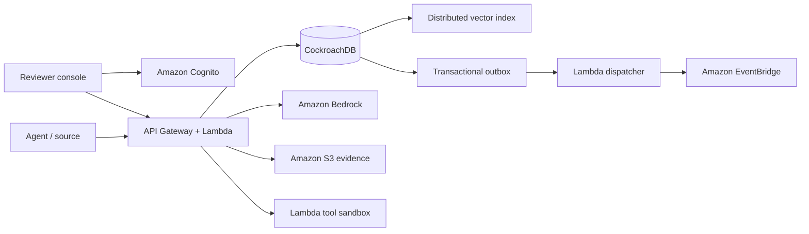

# Memory CI

> Ship agent memory with the same discipline as code.

Memory CI is the pull-request, test, release, lineage, and rollback control plane for production AI-agent memory. A memory cannot silently become production truth: it is proposed with provenance, screened for poisoning, evaluated against recorded trajectories, approved against a bound digest and baseline revision, then atomically promoted. Agents read only committed revisions.

Built for the [CockroachDB × AWS Hackathon](https://cockroachdb-ai.devpost.com/).

## Live product

- Demo: [memory-ci.asaborodaniel.chatgpt.site](https://memory-ci.asaborodaniel.chatgpt.site)
- Guided story: open **Onboarding**, then run the poison-attempt, policy-promotion, second-agent, and rollback path.
- The hosted UI uses a deterministic Northstar refund-agent fixture so judges can replay the entire story without credentials. Cloud controls fail closed and are never represented as live evidence unless authenticated proof exists.

## Why this needs CockroachDB

Memory CI keeps the operational record and the semantic index in one serializable system:

- transactional candidates, immutable audit chain, reviews, evaluation results, releases, namespace revisions, and rollback lineage;
- `VECTOR(1024)` embeddings and distributed vector indexes—no consistency gap with a separate vector store;
- serializable promotion and rollback transactions with bounded `40001` retry, idempotency keys, active-version uniqueness, and an outbox;
- tenant-scoped queries, least-privilege `memory_ci_app` and read-only `memory_ci_auditor` roles;
- schema and operational review performed with the official open-source CockroachDB Agent Skills.

This submission uses two qualifying CockroachDB tools: **Distributed Vector Indexing** and the **CockroachDB Agent Skills Repo**. Managed MCP and `ccloud` evidence scripts are included for authenticated judging, but are not falsely claimed as executed in this environment.

## AWS services

- **Amazon Bedrock** performs forced-tool semantic risk and behavioral-diff judgments; malformed or unavailable provider output is inconclusive, never a pass.
- **AWS Lambda** runs the authenticated API, transactional outbox dispatcher, and deterministic refund sandbox.
- **Amazon S3** stores content-addressed, versioned evaluation artifacts.
- **Amazon EventBridge** distributes idempotent memory lifecycle events.
- **Amazon Cognito**, CloudWatch, Secrets Manager, and X-Ray provide reviewer identity, alarms/log retention, secret delivery, and tracing.

The deployable SAM stack and least-privilege IAM are in [`infra/template.yaml`](infra/template.yaml).

## Architecture



See [`docs/architecture.md`](docs/architecture.md) for trust boundaries and the release protocol.

## Run locally

Requirements: Node.js 22.13+, Docker, and npm.

```bash
cp .env.example .env.local
npm install
docker compose up -d
npm run demo:reset
npm run dev
```

Open `http://localhost:3000/onboarding`. The demo reset is idempotent.

## Verify

```bash
npm run verify
npm run test:e2e
npm run infra:validate
npm run infra:build
npm run vector:evidence
```

Integration tests default to `postgresql://root@localhost:26258/defaultdb?sslmode=disable`; override with `TEST_DATABASE_URL`. AWS and Cockroach Cloud checks require real credentials and intentionally fail rather than manufacturing proof.

## Deploy AWS

1. Create a CockroachDB Cloud cluster and secret whose JSON contains `DATABASE_URL`.
2. Run migrations using an administrative connection, then use the `memory_ci_app` role at runtime.
3. Build and deploy:

```bash
npm run infra:validate
npm run infra:build
sam deploy --guided --template-file .aws-sam/build/template.yaml
```

4. Add a Cognito principal mapping in `principals.external_subject`, configure the console API URL, and run `npm run aws:smoke`.

## Repository map

- `app/` — responsive reviewer console and guided onboarding
- `src/domain/` — lifecycle, risk policy, screening, behavioral diffs
- `src/services/` — ingestion, evaluation, retrieval, promotion, explanation, rollback
- `src/db/` and `db/migrations/` — CockroachDB repositories, schema, security roles, vector indexes
- `src/aws/` and `src/lambda/` — Bedrock, S3, EventBridge, Cognito-facing runtime
- `tests/e2e/` — desktop/mobile journey and WCAG checks
- `scripts/` — deterministic demo plus cloud/vector/MCP evidence capture

## Security and evidence

Read [`SECURITY.md`](SECURITY.md) before deploying. The evidence matrix in [`docs/submission.md`](docs/submission.md) distinguishes implemented/tested proof from credential-dependent cloud proof.

MIT licensed. Contributions are welcome through issues and pull requests.
