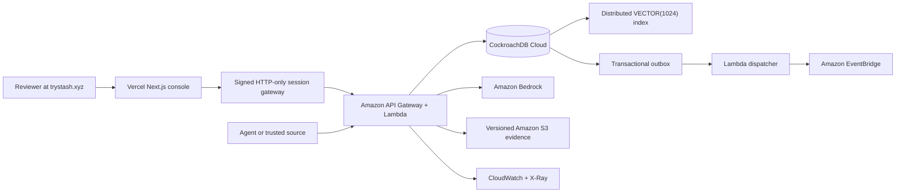

# Stash architecture and release protocol

## Production topology

Vercel exposes no database credential and never trusts a tenant or principal supplied by the browser. It creates a workspace through a protected AWS bootstrap route, signs a short-lived server session, and forwards only allow-listed same-origin operations. AWS maps the verified session to tenant-scoped persistence. CockroachDB remains the authority for both release state and semantic retrieval.

## Core invariant

Only an active `memory_versions` row at a committed namespace revision is visible to an agent. Candidates, evaluation output, stale approvals, and quarantined content never leak into retrieval.

## Release sequence

1. Ingestion canonicalizes and redacts content, validates immutable source identity and Ed25519 provenance, records a content digest, and creates a candidate.
2. Deterministic screening checks injection, scope broadening, protected-memory mutation, secret material, signature claims, attribution, replay, and expiry. Unverified elevated claims are rejected or downgraded.
3. Evaluation replays matched scenarios against baseline and candidate-overlay revisions. Tool constraints run deterministically; Bedrock produces a forced structured judgment. Timeout, refusal, or malformed output is inconclusive.
4. Review binds the candidate digest, evaluation run, policy version, and baseline revision.
5. One CockroachDB serializable transaction locks namespace lineage, rejects stale evidence, supersedes the prior active version, creates the new version, advances the revision, appends the audit and activation records, and enqueues the outbox event.
6. Retrieval embeds the query with managed Bedrock embeddings, searches the active tenant-scoped distributed vector index, and records the exact purpose and revision.
7. Rollback creates a new forward revision from a prior version. History is never updated or deleted.

## Trust boundaries and failure behavior

- Browser input, candidate text, model output, and lifecycle IDs are untrusted. Contracts are strict and responses are projected before reaching the browser.
- The production session cookie is `Secure`, `HttpOnly`, `SameSite=Lax`, audience-bound, issuer-bound to `trystash.xyz`, and server-signed.
- Secrets Manager supplies the restricted CockroachDB runtime URL. Administrative migration credentials do not enter Lambda or Vercel.
- S3 evidence is encrypted, private, versioned, content-addressed, and independently correlated to EventBridge and Bedrock provider receipts.
- Audit events form a tenant-serialized SHA-256 chain; application roles cannot update or delete them.
- Serialization failures retry with a bound. Ambiguous commits, missing scenarios, provider failures, stale reviews, missing embeddings, and conflicting idempotency keys fail closed.

## Verified production evidence

The redacted receipt in [evidence/stash-production.json](evidence/stash-production.json) was assembled from live AWS, CockroachDB Cloud, and `ccloud` observations. It proves a persistent idempotent workspace, Bedrock evaluator and embedding invocations, a versioned S3 artifact, EventBridge delivery, CloudWatch/X-Ray correlation, a `VECTOR(1024)` column, a succeeded distributed vector-index job, and an `EXPLAIN` plan using that index.
