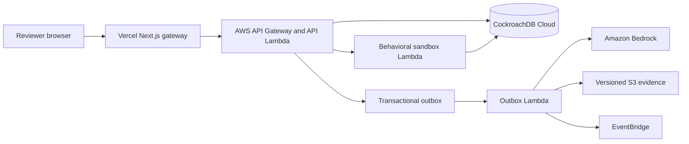

Stash separates the browser-facing reviewer experience from the trusted release and evidence plane. The boundary matters because memory promotion changes future agent behavior.

## Reviewer boundary

The browser calls same-origin Next.js routes. A server-only bootstrap key creates an isolated workspace, and the gateway stores a signed session in an HTTP-only, secure, same-site cookie. Browser code receives workspace metadata, not bootstrap credentials or the session signing secret.

## Application boundary

API Gateway invokes the API Lambda. The router verifies the bearer token, checks tenant membership, validates strict JSON bodies, requires reviewer or administrator roles for lifecycle mutations, and propagates a request ID. Services apply tenant-scoped operations to CockroachDB.

## Transaction and evidence boundary

Lifecycle requests record state, audit events, and an outbox message transactionally. Evaluation work runs after the request: the outbox worker invokes Bedrock, stores content-addressed evidence in S3, and emits lifecycle observations to EventBridge. A queued request is not treated as passed evidence.

Promotion and rollback execute in CockroachDB transactions. They update active-version state, namespace revision, activation events, audit lineage, and outbox work as a single release protocol.

## Behavioral sandbox

Evaluation scenarios replay candidate behavior outside the reviewer browser. Deterministic assertions and semantic judgment produce a result of passed, regressed, or inconclusive. Provider failure cannot be converted into a pass.

See [the security model](/concepts/security-model) for authorization and provenance controls, and [production evidence](/evidence/production) for the point-in-time cloud receipt.
