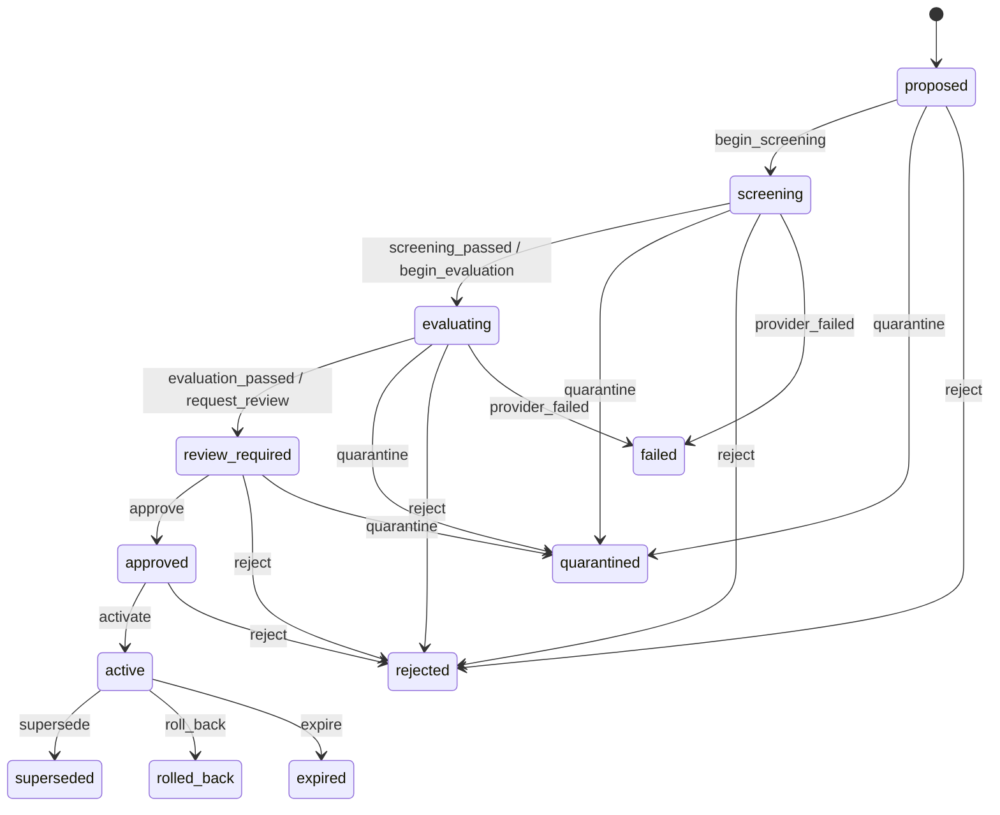

Stash treats durable memory as a release artifact. A candidate is immutable input to a state machine; a memory version is the released result of an approved candidate.

## Evidence before authority

Screening checks deterministic risk and source rules. Evaluation binds results to the candidate and the baseline namespace revision. Review then binds the candidate digest, evaluation run, baseline revision, and policy version. Promotion rejects a stale or mismatched review.

## One active version per lineage

The database enforces one active version for each tenant and lineage. Promotion deactivates the previous version, creates the next version, advances the namespace revision, and records the activation and audit events transactionally.

## Rollback moves forward

Rollback does not reactivate a row in place or delete an unsafe release. It creates a new memory version and a new namespace revision using a prior payload. This preserves what agents saw, who changed it, and why the system moved back.

For lookup-oriented details, see [lifecycle states](/reference/lifecycle-states). For operational steps, see [how to roll back a lineage](/guides/rollback-lineage).
